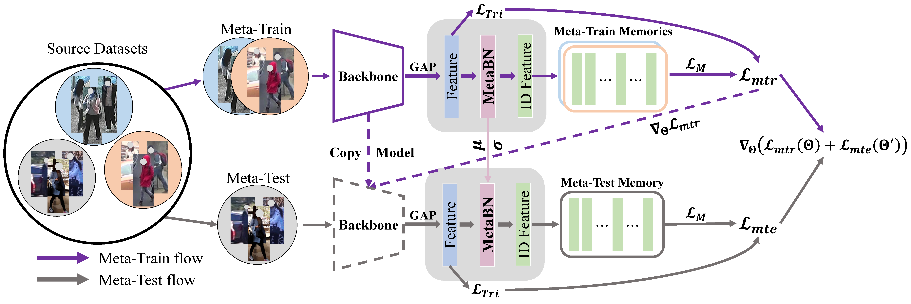
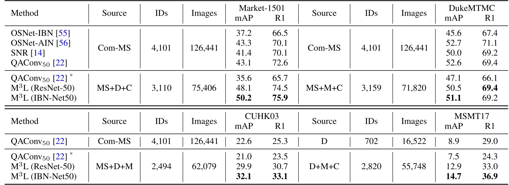

## [Learning to Generalize Unseen Domains via Memory-based Multi-Source Meta-Learning for Person Re-Identification](https://arxiv.org/abs/2012.00417) (CVPR 2021)

<!-- ### Introduction
This is the Pytorch implementation for M<sup>3</sup>L. -->



 
### Requirements

- CUDA>=10.0
- At least three 2080-Ti GPUs 
- Other necessary packages listed in [requirements.txt](requirements.txt)
- Training Data

  The model is trained and evaluated on [Market-1501](https://drive.google.com/file/d/0B8-rUzbwVRk0c054eEozWG9COHM/view), [DukeMTMC-reID](https://drive.google.com/file/d/1jjE85dRCMOgRtvJ5RQV9-Afs-2_5dY3O/view), [MSMT17_V1](https://www.pkuvmc.com/dataset.html), [MSMT17_V2](https://www.pkuvmc.com/dataset.html), [CUHK03](https://drive.google.com/file/d/1ILKiSthHm_XVeRQU2ThWNDVSO7lKWAZ_/view?usp=sharing) and [CUHK-NP](https://github.com/zhunzhong07/person-re-ranking/blob/master/CUHK03-NP/README.md)


  Unzip all datasets and ensure the file structure is as follow:
   
   ```
   data    
   │
   └─── market1501 / dukemtmc / cuhknp / cuhk03 / msmt17v1 / msmt17v2
        │   
        └─── DukeMTMC-reID / Market-1501-v15.09.15 / detected / cuhk03_release / MSMT17_V1 / MSMT17_V2
   ```
   <!-- |        │   
   |        └─── bounding_box_train
   |        │   
   |        └─── bounding_box_test
   |        | 
   |        └─── query
   └─── msmt17
   |    │   
   |    └─── MSMT17_V2
   |        │   
   |        └─── mask_train_v2
   |        │   
   |        └─── mask_test_v2
   |        | 
   |        └─── list_train.txt
   |        │   
   |        └─── list_val.txt
   |        │   
   |        └─── list_query.txt
   |        | 
   |        └─── list_gallery.txt
   └─── cuhk03
   |    │   
   |    └─── cuhk03_release
   |        │   
   |        └─── images
   |        │   
   |        └─── splits.json
   |        | 
   |        └─── meta.json -->
  <b> 

  *Note:* 

  In default, for CUHK03, we use the old protocol (CUHK03, 26,263 images of 1,367 IDs for training) as the source domain for training the model and the detected subset of the new protocol (CUHK-NP) as the target domain for testing; for MSMT17, we use the MSMT17\_V2 for both training and testing.
  We also provide the results of using *the detected subset of CUHK-NP* (7,365 images of 767 IDs for training) and *MSMT17\_V1* for both training and testing, and we recommend using this setting in future studies.

<!-- For CUHK03 dataset, we use the old protocol (CUHK03) as the source domain for training the model and the detected subset of the new protocol (CUHK-NP) as the target domain for evaluation. 

For MSMT17, we use the MSMT17_V2 for both training and testing. 

We recommend using *the detected subset of CUHK-NP* and *MSMT17_V1* for both training and testing and we will add the results with them at a later date.  -->
  </b>

### Run
```
ARCH=resMeta/IBNMeta
SRC1/SRC2/SRC3=market1501/dukemtmc/cuhk03/cuhknp/msmt17v1/msmt17v2
TARGET=market1501/dukemtmc/cuhknp/msmt17v1/msmt17v2

# train
CUDA_VISIBLE_DEVICES=0,1,2 python main.py \
-a $ARCH --BNNeck \
--dataset_src1 $SRC1 --dataset_src2 $SRC2 --dataset_src3 $SRC3 -d $TARGET \
--logs-dir $LOG_DIR --data-dir $DATA_DIR

# evaluate
python main.py \
-a $ARCH -d $TARGET \
--logs-dir $LOG_DIR --data-dir $DATA_DIR \
--evaluate --resume $RESUME
```

### Results


You can download the above models in the paper from [Google Drive](https://drive.google.com/drive/folders/1P_1nsTirOQ_8OZU0rgEx9eH1M34v5S0v?usp=sharing). The model is named as `$TARGET_$ARCH.pth.tar`.

### Acknowledgments
This repo borrows partially from [MWNet](https://github.com/xjtushujun/meta-weight-net), 
[ECN](https://github.com/zhunzhong07/ECN) and 
[SpCL](https://github.com/yxgeee/SpCL).

### Citation
```
@inproceedings{zhao2021learning,
  title={Learning to Generalize Unseen Domains via Memory-based Multi-Source Meta-Learning for Person Re-Identification},
  author={Zhao, Yuyang and Zhong, Zhun and Yang, Fengxiang and Luo, Zhiming and Lin, Yaojin and Li, Shaozi and Nicu, Sebe},
  booktitle={CVPR},
  year={2021},
}
```

### Contact
Email: yuyangzhao98@gmail.com