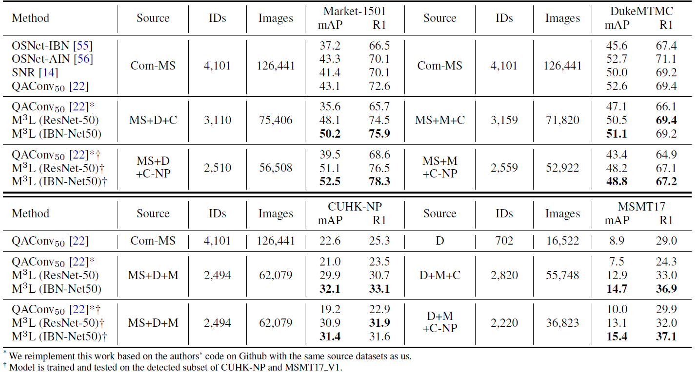

## [Learning to Generalize Unseen Domains via Memory-based Multi-Source Meta-Learning for Person Re-Identification](https://arxiv.org/abs/2012.00417) (CVPR 2021)

### Introduction
This is the Pytorch implementation for M<sup>3</sup>L.


 
### Requirements

- CUDA>=10.0
- At least three 2080-Ti GPUs 
- Other necessary packages listed in [requirements.txt](requirements.txt)
- Training Data

  The model is trained and evaluated on [Market-1501](https://drive.google.com/file/d/0B8-rUzbwVRk0c054eEozWG9COHM/view), [DukeMTMC-reID](https://drive.google.com/file/d/1jjE85dRCMOgRtvJ5RQV9-Afs-2_5dY3O/view), [MSMT17](https://drive.google.com/file/d/1c0J6V5XX3_gmIZDW0FObyfyUAohLkv9S/view?usp=sharing), [CUHK03](https://drive.google.com/file/d/1ILKiSthHm_XVeRQU2ThWNDVSO7lKWAZ_/view?usp=sharing) and [CUHK-NP](https://github.com/zhunzhong07/person-re-ranking/blob/master/CUHK03-NP/README.md)
  
  Unzip all datasets and ensure the file structure is as follow:
   
   ```
   data    
   │
   └─── market1501 / dukemtmc / cuhknp / cuhk03 / msmt17
        │   
        └─── DukeMTMC-reID / Market-1501-v15.09.15 / (labeled / detected) / cuhk03_release / MSMT17_V2
   ```
   <!-- |        │   
   |        └─── bounding_box_train
   |        │   
   |        └─── bounding_box_test
   |        | 
   |        └─── query
   └─── msmt17
   |    │   
   |    └─── MSMT17_V2
   |        │   
   |        └─── mask_train_v2
   |        │   
   |        └─── mask_test_v2
   |        | 
   |        └─── list_train.txt
   |        │   
   |        └─── list_val.txt
   |        │   
   |        └─── list_query.txt
   |        | 
   |        └─── list_gallery.txt
   └─── cuhk03
   |    │   
   |    └─── cuhk03_release
   |        │   
   |        └─── images
   |        │   
   |        └─── splits.json
   |        | 
   |        └─── meta.json -->

### Run
```
ARCH=resMeta/IBNMeta
SRC1/SRC2/SRC3=market1501/dukemtmc/cuhk03/msmt17
TARGET=market1501/dukemtmc/cuhknp/msmt17

# train
CUDA_VISIBLE_DEVICES=0,1,2 python main.py \
-a $ARCH --BNNeck \
--dataset_src1 $SRC1 --dataset_src2 $SRC2 --dataset_src3 $SRC3 -d $TARGET \
--logs-dir $LOG_DIR --data-dir $DATA_DIR

# evaluate
python main.py \
-a $ARCH -d $TARGET --BNNeck \
--logs-dir $LOG_DIR --data-dir $DATA_DIR \
--evaluate --resume $RESUME
```

**Note:** For CUHK03 dataset, we use the old protocol (cuhk03) as the source domain for training the model and detected subset of the new protocol (cuhknp) as the target domain for evaluation. We will add the results with cuhknp as the source domain at a later date.

### Results


You can download the above models in the paper from [Google Drive](https://drive.google.com/drive/folders/1P_1nsTirOQ_8OZU0rgEx9eH1M34v5S0v?usp=sharing). The model is named as `$TARGET_$ARCH.pth.tar`.

### Acknowledgments
This repo borrows partially from [MWNet](https://github.com/xjtushujun/meta-weight-net), 
[ECN](https://github.com/zhunzhong07/ECN) and 
[SpCL](https://github.com/yxgeee/SpCL).

### Citation
```
@inproceedings{zhao2021learning,
  title={Learning to Generalize Unseen Domains via Memory-based Multi-Source Meta-Learning for Person Re-Identification},
  author={Zhao, Yuyang and Zhong, Zhun and Yang, Fengxiang and Luo, Zhiming and Lin, Yaojin and Li, Shaozi and Nicu, Sebe},
  booktitle={CVPR},
  year={2021},
}
```

### Contact
Email: yuyangzhao98@gmail.com